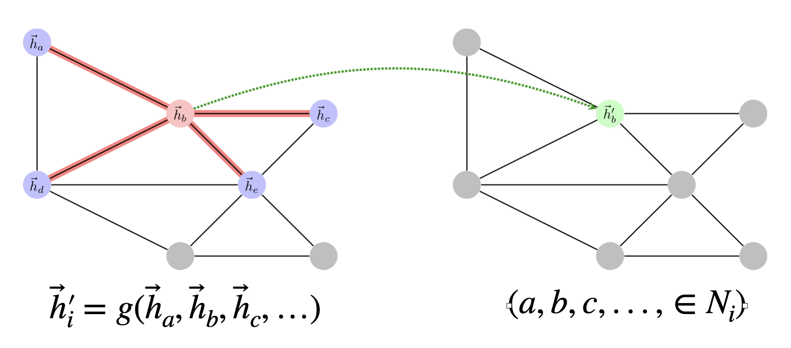

# **Графовые нейроные сети**


## 1. Введение
Графовые нейронные сети (GNN) — это класс моделей глубокого обучения,
предназначенный для работы с данными в виде графов. Они применяются для решения задач:

- Классификации узлов (node classification). Например, тема научной статьи в графе цитирования.
- Классификации графов (graph classification). Предсказание/выявление метки всего графа. Например, токсичность молекулы.
- Предсказания связей (link prediction). Например, захочет ли пользователь $X$ купить товар $Y$.

GNN обучаются извлекать векторные представления (эмбеддинги) узлов и графов, используя структурную информацию.

## 2. Основная архитектура и этапы работы
Входные данные:

- Граф $G=(V,E)$ , где $V$ — узлы, $E$ — рёбра.
- Признаки узлов $X \in R^{∣V∣ \times F}$, где $F$ – размерность пространства признаков,
которые изначальное известы об узлах
Матрица смежности $A$ .

**Процесс обработки:**

Input Layer: признаки узлов подаются на вход.
Graph Neural Network Layer: последовательное применение слоёв GNN для получения скрытых представлений.
Prediction Head: финальный слой (например, полносвязный), преобразующий векторные представлеения в предсказания.
Loss Function: вычисление ошибки между предсказаниями и истинными метками.

## 3. Простая свёрточная графовая сеть (GCN – Graph Convolutional Network)

### 3.1 Желаемые свойства операции свёртки на графах


Хотелось бы, чтобы операция в GNN обладала следующими свойствами:
- **Эффективность вычислений и хранения**: время и память не более $ O(|V| + |E|) $.
- **Фиксированное число параметров**: число параметров не зависит от размера графа.
- **Локальность**: обновление векторного вложения узла зависит только от его окрестности.
- **Возможность указывать произвольные значения для разных соседей**
- **Трансдуктивность/индуктивность**: способность обобщаться на новые графы или узлы, не виденные при обучении.

### 3.2 Базовая модель
**Идея:** агрегация информации от соседей через матрицу смежности.

**Обновление скрытых состояний:**
$$
H' = \sigma(\tilde{A} H W)
$$
где:
- $ \tilde{A} = A + I $ — матрица смежности с учётом петель (self-loops),
- $ W $ — обучаемая матрица преобразования,
- $ \sigma $ — нелинейная функция (например, ReLU).

**Проблема масштаба:** значения могут расти при умножении на $A$.  
**Решение — нормализация:**
- **Mean-pooling rule**: $H' = \sigma(D^{-1} \tilde{A} H W)$
- **Симметричная нормализация (GCN):**
  $$
  H' = \sigma(\hat{D}^{-1/2} \hat{A} \hat{D}^{-1/2} H W)
  $$
  где $ \hat{A} = A + I $, $ \hat{D}_{ii} = \sum_j \hat{A}_{ij} $.

**Популярность GCN:** простота, эффективность, хорошая производительность (наиболее цитируемая работа в области GNN) (Kipf & Welling, ICLR 2017).


### 3.3 Пример реализации простой GCN на PyTorch

```python
import torch
from torch import nn

class GCN(nn.Module):
    def __init__(self, *sizes):
        super().__init__()
        self.layers = nn.ModuleList([
            nn.Linear(x, y) for x, y in zip(sizes[:-1], sizes[1:])
        ])
    
    def forward(self, vertices, edges):
        adj = torch.eye(len(vertices))
        adj[edges[:,0], edges[:,1]] = 1
        adj[edges[:,1], edges[:,0]] = 1
        for layer in self.layers:
            vertices = torch.sigmoid(layer(adj @ vertices))
        return vertices
```

## 4. Обобщённая модель: MPNN (Message Passing Neural Network)

**Идея:** явное моделирование передачи сообщений между узлами.

**Два шага:**
1. **Message function**:
   $$
   m_{ij} = f_m(h_i, h_j, e_{ij})
   $$
   где $ e_{ij} $ — признаки ребра.
2. **Aggregation & Update**:
   $$
   h_i' = f_u\left(h_i, \sum_{j \in N(i)} m_{ij}\right)
   $$

**Преимущества:**
- Поддержка признаков рёбер.
- Высокая гибкость.

**Недостатки:**
- Требует хранения промежуточных сообщений.
- Не масштабируется на большие графы.

---

## 4. Агрегация окрестностей (Neighborhood Aggregation)
Центральный механизм GNN — итеративное обновление векторных представлений вершин на основе их соседей.

- **Simple aggregation**:  
  $ h_v^{(k)} = \sigma\left(W_k \cdot \left(h_v^{(k-1)} + \sum_{u \in N(v)} h_u^{(k-1)}\right)\right) $

- **GraphSAGE**:
  Использует параметризуемые функции агрегации и объединяет информацию о самом узле и его окрестности:
  $$
  h_v^{(k)} = \sigma\left(W_k \cdot \text{CONCAT}\left(h_v^{(k-1)}, \text{AGGREGATE}_k(\{h_u^{(k-1)}, \forall u \in N(v)\})\right)\right)
  $$

Алгоритм GraphSAGE:
1. Начальные эмбеддинги: $ h_v^{(0)} = x_v $
2. Для каждого слоя $ k = 1..K $:
   - Агрегировать эмбеддинги соседей
   - Объединить с собственным эмбеддингом
   - Применить линейное преобразование и нелинейность
3. Финальные эмбеддинги: $ z_v = h_v^{(K)} $

5. Преимущества GNN
- Эффективность вычислений и хранения (время $ O(|V| + |E|) $)
- Фиксированное число параметров (независимо от размера графа)
- Локальность: обновление зависит только от окрестности узла
- Возможность задавать разные веса для разных соседей
- Трансдуктивность: модель может работать с конкретным графом, используя все его узлы при обучении

## 6. Механизм внимания в GNN (GAT — Graph Attention Network)
GAT автоматически вычисляет веса важности соседей с помощью механизма внимания.

- Вычисление коэффициента внимания между узлами $ i $ и $ j $:
  $$
  a_{ij} = \frac{\exp(\text{LeakyReLU}(a^T[Wh_i || Wh_j]))}{\sum_{k \in N(i)} \exp(\text{LeakyReLU}(a^T[Wh_i || Wh_k]))}
  $$
- Обновление эмбеддинга:
  $$
  h_i' = \sigma\left(\sum_{j \in N(i)} a_{ij} Wh_j\right)
  $$
- Multihead Attention: использование нескольких голов внимания для стабильности и выразительности.

## 7. Постановка эксперимента.  Типы обучения.
### 7.1 Трансдуктивное обучение

  

  - В обучении, тесте и валидации используется 1 граф
  - Все узлы и все рёбра присутствуют во время обучения
  - На этапе обучения модель видит как помеченные, так и непомеченные узлы
  - Примеры: Cora, Citeseer, Pubmed.
  - Результаты (точность):
    - GCN: 81.5% (Cora), 70.3% (Citeseer), 79.0% (Pubmed)
    - GAT: **83.0%**, **72.5%**, **79.0%**

   
### 7.2 Индуктивное обучение

  - Модель обучается и тестируется на разных графах. То есть на одном наборе графов обучается и применяется к новым, ранее невиданным.
  - Пример: PPI (Protein-Protein Interaction).
  - Результаты (F1-score):
    - GraphSAGE*: 0.768
    - GAT: **0.973 ± 0.002**
---
### 7.3 Пример преимущество трансдукции на общем случае
---
  
  
  "Преимущество трансдукции заключается в возможности учитывать все точки, а не только помеченные, при выполнении задачи классификации. В этом случае трансдуктивные алгоритмы будут классифицировать непомеченные точки в соответствии с кластерами, к которым они естественным образом принадлежат. Таким образом, точки в середине, скорее всего, будут помечены как «B», поскольку они расположены очень близко к этому кластеру" ([цитата из Википедии](https://en.wikipedia.org/wiki/Transduction_(machine_learning)) )


## 8. Инструменты и библиотеки
- [PyTorch Geometric](https://pytorch-geometric.readthedocs.io/) — основная библиотека для GNN на PyTorch.
- [DGL (Deep Graph Library)](https://www.dgl.ai/) — гибкая платформа для построения GNN.
- [DeepSNAP](https://github.com/snap-stanford/deepsnap) — работа с графами и подграфами.
- [GraphGym](https://github.com/snap-stanford/GraphGym) — экспериментальная платформа.
- [Graph Nets (Google/DeepMind)](https://github.com/deepmind/graph_nets) — на базе TensorFlow.
