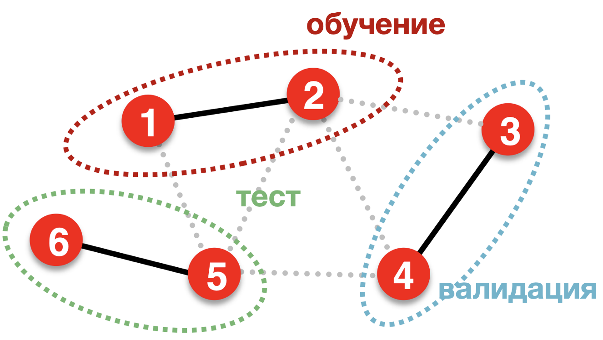
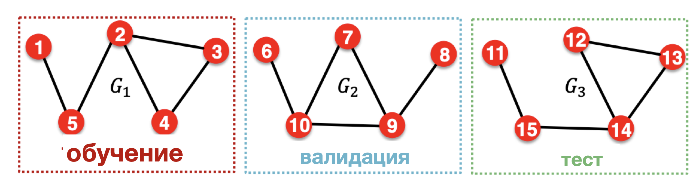
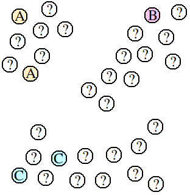

# **Графовые нейроные сети**


## 1. Общая архитектура GNN
Графовые нейронные сети (Graph Neural Networks, GNN) предназначены для обработки данных, представленных в виде графов. Основная задача — преобразовать входные данные графа в полезные векторные представления (эмбеддинги), которые затем используются для решения различных задач.

- Вход: граф $ G = (V, E) $, где $ V $ — узлы, $ E $ — рёбра; и признаки узлов $ X $.
- Скрытые слои: последовательность слоёв GNN, каждый из которых обновляет векторные представления узлов на основе информации от соседей.
- Выход: векторные представления $ Z $, используемые для:
  - Классификации узлов
  - Классификации графов
  - Предсказания связей

## 2. Задачи, решаемые GNN
- Классификация узлов: определение метки каждого узла (например, тема научной статьи в графе цитирования).
- Классификация графов: предсказание метки всего графа (например, токсичность молекулы).
- Предсказание связей: определение наличия или типа связи между узлами.

## 3. Простой GCN (Graph Convolutional Network)
Пример реализации простого GCN на PyTorch:

```python
import torch
from torch import nn

class GCN(nn.Module):
    def __init__(self, *sizes):
        super().__init__()
        self.layers = nn.ModuleList([
            nn.Linear(x, y) for x, y in zip(sizes[:-1], sizes[1:])
        ])
    
    def forward(self, vertices, edges):
        adj = torch.eye(len(vertices))
        adj[edges[:,0], edges[:,1]] = 1
        adj[edges[:,1], edges[:,0]] = 1
        for layer in self.layers:
            vertices = torch.sigmoid(layer(adj @ vertices))
        return vertices
```

## 4. Агрегация окрестностей (Neighborhood Aggregation)
Центральный механизм GNN — итеративное обновление векторных представлений вершин на основе их соседей.

- **Simple aggregation**:  
  $ h_v^{(k)} = \sigma\left(W_k \cdot \left(h_v^{(k-1)} + \sum_{u \in N(v)} h_u^{(k-1)}\right)\right) $

- **GraphSAGE**:
  Использует параметризуемые функции агрегации и объединяет информацию о самом узле и его окрестности:
  $$
  h_v^{(k)} = \sigma\left(W_k \cdot \text{CONCAT}\left(h_v^{(k-1)}, \text{AGGREGATE}_k(\{h_u^{(k-1)}, \forall u \in N(v)\})\right)\right)
  $$

Алгоритм GraphSAGE:
1. Начальные эмбеддинги: $ h_v^{(0)} = x_v $
2. Для каждого слоя $ k = 1..K $:
   - Агрегировать эмбеддинги соседей
   - Объединить с собственным эмбеддингом
   - Применить линейное преобразование и нелинейность
3. Финальные эмбеддинги: $ z_v = h_v^{(K)} $

5. Преимущества GNN
- Эффективность вычислений и хранения (время $ O(|V| + |E|) $)
- Фиксированное число параметров (независимо от размера графа)
- Локальность: обновление зависит только от окрестности узла
- Возможность задавать разные веса для разных соседей
- Трансдуктивность: модель может работать с конкретным графом, используя все его узлы при обучении

## 6. Механизм внимания в GNN (GAT — Graph Attention Network)
GAT автоматически вычисляет веса важности соседей с помощью механизма внимания.

- Вычисление коэффициента внимания между узлами $ i $ и $ j $:
  $$
  a_{ij} = \frac{\exp(\text{LeakyReLU}(a^T[Wh_i || Wh_j]))}{\sum_{k \in N(i)} \exp(\text{LeakyReLU}(a^T[Wh_i || Wh_k]))}
  $$
- Обновление эмбеддинга:
  $$
  h_i' = \sigma\left(\sum_{j \in N(i)} a_{ij} Wh_j\right)
  $$
- Multihead Attention: использование нескольких голов внимания для стабильности и выразительности.

## 7. Постановка эксперимента.  Типы обучения.
### 7.1 Трансдуктивное обучение
  
  - В обучении, тесте и валидации используется 1 граф
  - Все узлы и все рёбра присутствуют во время обучения
  - На этапе обучения модель видит как помеченные, так и непомеченные узлы
  - Примеры: Cora, Citeseer, Pubmed.
  - Результаты (точность):
    - GCN: 81.5% (Cora), 70.3% (Citeseer), 79.0% (Pubmed)
    - GAT: **83.0%**, **72.5%**, **79.0%**

   
### 7.2 Индуктивное обучение

  - Модель обучается и тестируется на разных графах. То есть на одном наборе графов обучается и применяется к новым, ранее невиданным.
  - Пример: PPI (Protein-Protein Interaction).
  - Результаты (F1-score):
    - GraphSAGE*: 0.768
    - GAT: **0.973 ± 0.002**
---
### 7.3 Пример преимущество трансдукции на общем случае
---
  
  
  Преимущество трансдукции заключается в возможности учитывать все точки, а не только помеченные, при выполнении задачи классификации. В этом случае трансдуктивные алгоритмы будут классифицировать непомеченные точки в соответствии с кластерами, к которым они естественным образом принадлежат. Таким образом, точки в середине, скорее всего, будут помечены как «B», поскольку они расположены очень близко к этому кластеру.
  [Материал из Википедии](https://en.wikipedia.org/wiki/Transduction_(machine_learning))


## 8. Инструменты и библиотеки
- [PyTorch Geometric](https://pytorch-geometric.readthedocs.io/) — основная библиотека для GNN на PyTorch.
- [DGL (Deep Graph Library)](https://www.dgl.ai/) — гибкая платформа для построения GNN.
- [DeepSNAP](https://github.com/snap-stanford/deepsnap) — работа с графами и подграфами.
- [GraphGym](https://github.com/snap-stanford/GraphGym) — экспериментальная платформа.
- [Graph Nets (Google/DeepMind)](https://github.com/deepmind/graph_nets) — на базе TensorFlow.
